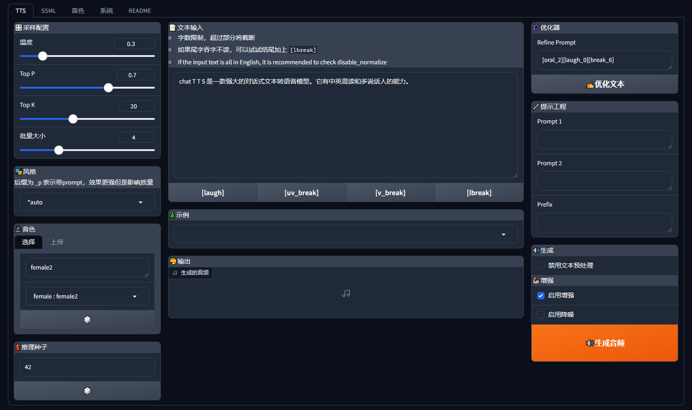

[cn](./README.md) | [en](./README.en.md) | [Discord Server](https://discord.gg/9XnXUhAy3t)

# 🍦 Speech-AI-Forge

Speech-AI-Forge 是一个围绕 TTS 生成模型开发的项目，实现了 API Server 和 基于 Gradio 的 WebUI。



你可以通过以下几种方式体验和部署 Speech-AI-Forge：

| -            | 描述                     | 链接                                                                                                                                                               |
| ------------ | ------------------------ | ------------------------------------------------------------------------------------------------------------------------------------------------------------------ |
| **在线体验** | 部署于 HuggingFace 中    | [HuggingFace Spaces](https://huggingface.co/spaces/lenML/ChatTTS-Forge)                                                                                            |
| **一键启动** | 点击按钮，一键启动 Colab | [](https://colab.research.google.com/github/lenML/Speech-AI-Forge/blob/main/colab.ipynb) |
| **容器部署** | 查看 docker 部分         | [Docker](#docker)                                                                                                                                                  |
| **本地部署** | 查看环境准备部分         | [本地部署](#InstallationandRunning)                                                                                                                                |

## Breaking change logs

- 250702: Support Index-TTS-1.5 [#250](https://github.com/lenML/Speech-AI-Forge/issues/250)
- 250522: Support GptSoVits [#198](https://github.com/lenML/Speech-AI-Forge/issues/198)
- 250518: Support SenseVoice ASR [#122](https://github.com/lenML/Speech-AI-Forge/issues/122)
- 250508: Support Spark-TTS [#223](https://github.com/lenML/Speech-AI-Forge/issues/223)
- 250507: Support F5TTS-TTS-v1 model [#231](https://github.com/lenML/Speech-AI-Forge/issues/231)
- 250505: Support Index-TTS [#229](https://github.com/lenML/Speech-AI-Forge/issues/229)
- 241111: Add `v2/tts` API [#187](https://github.com/lenML/Speech-AI-Forge/issues/187)
- 241109: Support fishspeech [#191](https://github.com/lenML/Speech-AI-Forge/issues/191)
- 241015: Support F5TTS v0.6.2 [#176](https://github.com/lenML/Speech-AI-Forge/issues/176)
- 241009: Support FireRedTTS [#165](https://github.com/lenML/Speech-AI-Forge/issues/165)
- 240813: Support OpenVoice [#100](https://github.com/lenML/Speech-AI-Forge/issues/100)
- 240801: Add ASR API [#92](https://github.com/lenML/Speech-AI-Forge/issues/92)
- 240723: Support CosyVoice [#90](https://github.com/lenML/Speech-AI-Forge/issues/90)

## Installation and Running

首先，确保 [相关依赖](./docs/dependencies.md) 已经正确安装，并查看 [模型下载](#模型下载) 下载所需模型

启动：

```
python webui.py
```

### webui features

[点我看详细图文介绍](./docs/webui_features.md)

- **TTS (文本转语音)**: 提供多种强大的 TTS 功能

  - **音色切换 (Speaker Switch)**: 可选择不同音色
    - **内置音色**: 提供多个内置音色，包括 `27 ChatTTS` / `7 CosyVoice` 音色 + `1 参考音色`
    - **自定义音色上传**: 支持上传自定义音色文件并进行实时推理
    - **参考音色**: 支持上传参考音频/文本，直接基于参考音频进行 TTS 推理
  - **风格控制 (Style)**: 内置多种风格控制选项，调整语音风格
  - **长文本推理 (Long Text)**: 支持超长文本的推理，自动分割文本
    - **Batch Size**: 支持设置 `Batch size`，提升支持批量推理模型的长文本推理速度
  - **Refiner**: 支持 `ChatTTS` 原生文本 `refiner`，支持无限长文本处理
  - **分割器设置 (Splitter)**: 调整分割器配置，控制分割结束符（`eos`）和分割阈值
  - **调节器 (Adjuster)**: 支持调整 `速度/音调/音量`，并增加 `响度均衡` 功能，优化音频输出
  - **人声增强 (Voice Enhancer)**: 使用 `Enhancer` 模型增强 TTS 输出，提高语音质量
  - **生成历史 (Generation History)**: 保存最近三次生成结果，便于对比和选择
  - **多模型支持 (Multi-model Support)**: 支持多种 TTS 模型推理，包括 `ChatTTS` / `CosyVoice` / `FishSpeech` / `GPT-SoVITS` / `F5-TTS` 等

- **SSML (语音合成标记语言)**: 提供高级 TTS 合成控制工具

  - **分割器 (Splitter)**: 精细控制长文本的分割结果
  - **Podcast**: 帮助创建 `长文本`、`多角色` 的音频，适合博客或剧本式的语音合成
  - **From Subtitle**: 从字幕文件生成 SSML 脚本，方便一键生成语音
  - **脚本编辑器 (Script Editor)**: 新增 SSML 脚本编辑器，支持从分割器（Podcast、来自字幕）导出并编辑 SSML 脚本，进一步优化语音生成效果

- **音色管理 (Voice Management)**:

  - **音色构建器 (Builder)**: 创建自定义音色，可从 ChatTTS seed 创建音色，或使用参考音频生成音色
  - **试音功能 (Test Voice)**: 上传音色文件，进行简单的试音和效果评估
  - **ChatTTS 调试工具**: 专门针对 `ChatTTS` 音色的调试工具
    - **音色抽卡 (Random Seed)**: 使用随机种子抽取不同的音色，生成独特的语音效果
    - **音色融合 (Blend)**: 融合不同种子创建的音色，获得新的语音效果
  - **音色 Hub**: 从音色库中选择并下载音色到本地，访问音色仓库 [Speech-AI-Forge-spks](https://github.com/lenML/Speech-AI-Forge-spks) 获取更多音色资源

- **ASR (自动语音识别)**:

  - **ASR**: 使用 Whisper/SenseVoice 等模型进行高质量的语音转文本（ASR）
  - **Force Aligment**: 使用 Whisper 模型可以进行【文稿匹配】提高识别准确性

- **工具 (Tools)**:
  - **后处理工具 (Post Process)**: 提供音频剪辑、调整和增强等功能，优化生成的语音质量

### `launch.py`: API Server

某些情况，你并不需要 webui 或者需要更高的 api 吞吐，那么可以使用这个脚本启动单纯的 api 服务。

启动：

```
python launch.py
```

启动之后开启 `http://localhost:7870/docs` 可以查看开启了哪些 api 端点

更多帮助信息:

- 通过 `python launch.py -h` 查看脚本参数
- 查看 [API 文档](./docs/api.md)

## Docker

### 镜像

WIP 开发中

### 手动 build

下载模型: `python -m scripts.download_models --source modelscope`

> 此脚本将下载 `chat-tts` 和 `enhancer` 模型，如需下载其他模型，请看后续的 `模型下载` 介绍

- webui: `docker-compose -f ./docker-compose.webui.yml up -d`
- api: `docker-compose -f ./docker-compose.api.yml up -d`

环境变量配置

- webui: [.env.webui](./.env.webui)
- api: [.env.api](./.env.api)

## 模型支持

| 模型类别        | 模型名称                                                           | 流式级别 | 支持多语言          | 实现情况    |
| --------------- | ------------------------------------------------------------------ | -------- | ------------------- | ----------- |
| **TTS**         | [ChatTTS](https://github.com/2noise/ChatTTS)                       | token 级 | en, zh              | ✅          |
|                 | [FishSpeech](https://github.com/fishaudio/fish-speech)             | 句子级   | en, zh, jp, ko      | ✅ (1.4)    |
|                 | [CosyVoice](https://github.com/FunAudioLLM/CosyVoice)              | 句子级   | en, zh, jp, yue, ko | ✅(v2)      |
|                 | [FireRedTTS](https://github.com/FireRedTeam/FireRedTTS)            | 句子级   | en, zh              | ✅          |
|                 | [F5-TTS](https://github.com/SWivid/F5-TTS)                         | 句子级   | en, zh              | ✅(v0.6/v1) |
|                 | [Index-TTS](https://github.com/index-tts/index-tts)                | 句子级   | en, zh              | ✅(v1/v1.5) |
|                 | [Spark-TTS](https://github.com/SparkAudio/Spark-TTS)               | 句子级   | en, zh              | ✅          |
|                 | [GPT-SoVITS](https://github.com/RVC-Boss/GPT-SoVITS/tree/main)     | 句子级   | en, zh, ja, ko, yue | ✅          |
| **ASR**         | [Whisper](https://github.com/openai/whisper)                       | 🚧       | ✅                  | ✅          |
|                 | [SenseVoice](https://github.com/FunAudioLLM/SenseVoice)            | 🚧       | ✅                  | ✅          |
| **Voice Clone** | [OpenVoice](https://github.com/myshell-ai/OpenVoice)               |          |                     | ✅          |
| **Enhancer**    | [ResembleEnhance](https://github.com/resemble-ai/resemble-enhance) |          |                     | ✅          |

## 模型下载

由于 Forge 主要面向 API 功能开发，目前尚未实现自动下载逻辑，下载模型需手动调用下载脚本，具体脚本位于 `./scripts` 目录下。

### 下载脚本

| 功能         | 模型             | 下载命令                                                                    |
| ------------ | ---------------- | --------------------------------------------------------------------------- |
| **TTS**      | ChatTTS          | `python -m scripts.dl_chattts --source huggingface`                         |
|              | FishSpeech(1.4)  | `python -m scripts.downloader.fish_speech_1_4 --source huggingface`         |
|              | GPT-SoVITS(v4)   | `python -m scripts.downloader.gpt_sovits_v4 --source huggingface`           |
|              | CosyVoice(v2)    | `python -m scripts.downloader.cosyvoice2 --source huggingface`              |
|              | FireRedTTS       | `python -m scripts.downloader.fire_red_tts --source huggingface`            |
|              | Index-TTS-1.5    | `python -m scripts.downloader.index_tts_1_5 --source huggingface`           |
|              | Index-TTS        | `python -m scripts.downloader.index_tts --source huggingface`               |
|              | Spark-TTS        | `python -m scripts.downloader.spark_tts --source huggingface`               |
|              | F5-TTS(v0.6)     | `python -m scripts.downloader.f5_tts --source huggingface`                  |
|              | F5-TTS(v1)       | `python -m scripts.downloader.f5_tts_v1 --source huggingface`               |
|              | F5-TTS(vocos)    | `python -m scripts.downloader.vocos_mel_24khz --source huggingface`         |
| **ASR**      | Whisper V3       | `python -m scripts.downloader.faster_whisper --source huggingface`          |
|              | Whisper V3 turbo | `python -m scripts.downloader.faster_whisper_v3_turbo --source huggingface` |
|              | SenseVoice       | `python -m scripts.downloader.sensevoice_small --source huggingface`        |
|              | fsmn-vad       | `python -m scripts.downloader.fsmn_vad --source huggingface`        |
| **CV**       | OpenVoice        | `python -m scripts.downloader.open_voice --source huggingface`              |
| **Enhancer** | 增强模型         | `python -m scripts.dl_enhance --source huggingface`                         |

> **注意**：如果需要使用 ModelScope 下载模型，请使用 `--source modelscope`。部分模型可能无法使用 ModelScope 下载。

## FAQ

[Goto Discussion Page](https://github.com/lenML/Speech-AI-Forge/discussions/242)

## 离线整合包

感谢 @Phrixus2023 提供的整合包：
https://pan.baidu.com/s/1Q1vQV5Gs0VhU5J76dZBK4Q?pwd=d7xu

相关讨论：
https://github.com/lenML/Speech-AI-Forge/discussions/65

# Documents

[](https://deepwiki.com/lenML/Speech-AI-Forge)

[Learn About Documents](https://github.com/lenML/Speech-AI-Forge/issues/240)

# Contributing

To contribute, clone the repository, make your changes, commit and push to your clone, and submit a pull request.

## format code

```
isort --profile black
```

# References

- ChatTTS: https://github.com/2noise/ChatTTS
- PaddleSpeech: https://github.com/PaddlePaddle/PaddleSpeech
- resemble-enhance: https://github.com/resemble-ai/resemble-enhance
- OpenVoice: https://github.com/myshell-ai/OpenVoice
- FishSpeech: https://github.com/fishaudio/fish-speech
- SenseVoice: https://github.com/FunAudioLLM/SenseVoice
- CosyVoice: https://github.com/FunAudioLLM/CosyVoice
- FireRedTTS: https://github.com/FireRedTeam/FireRedTTS
- F5-TTS: https://github.com/SWivid/F5-TTS
- Index-TTS: https://github.com/index-tts/index-tts
- Spark-TTS: https://github.com/SparkAudio/Spark-TTS
- GPT-SoVITS: https://github.com/RVC-Boss/GPT-SoVITS

- Whisper: https://github.com/openai/whisper

- ChatTTS 默认说话人: https://github.com/2noise/ChatTTS/issues/238
