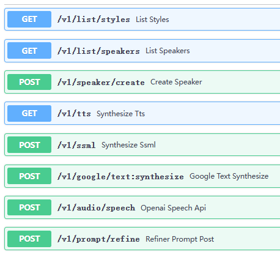
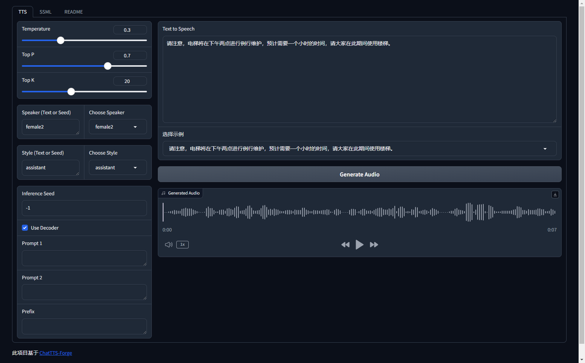
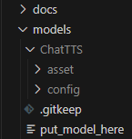

# 🍦 ChatTTS-Forge

ChatTTS-Forge 是一个围绕 TTS 生成模型 ChatTTS 开发的项目，实现了 API Server 和 基于 Gradio 的 WebUI。


你可以通过以下几种方式体验和部署 ChatTTS-Forge：

| -            | 描述                     | 链接                                                                                                                                                             |
| ------------ | ------------------------ | ---------------------------------------------------------------------------------------------------------------------------------------------------------------- |
| **在线体验** | 部署于 HuggingFace 中    | [HuggingFace Spaces](https://huggingface.co/spaces/lenML/ChatTTS-Forge)                                                                                          |
| **一键启动** | 点击按钮，一键启动 Colab | [](https://colab.research.google.com/github/lenML/ChatTTS-Forge/blob/main/colab.ipynb) |
| **容器部署** | 查看 docker 部分         | [Docker](#docker)                                                                                                                                                |
| **本地部署** | 查看环境准备部分         | [本地部署](#本地部署)                                                                                                                                            |

## 1. <a name='INDEX'></a>INDEX

<!-- vscode-markdown-toc -->

- 1. [INDEX](#INDEX)
- 2. [Features](#Features)
- 3. [Interface](#Interface)
- 4. [本地部署](#)
  - 4.1. [`launch.py`: API Server](#launch.py:APIServer)
    - 4.1.1. [OpenAI API: `v1/audio/speech`](#OpenAIAPI:v1audiospeech)
    - 4.1.2. [Google API: `/v1/text:synthesize`](#GoogleAPI:v1text:synthesize)
  - 4.2. [`webui.py`: WebUI](#webui.py:WebUI)
    - 4.2.1. [webui features](#webuifeatures)
- 5. [Benchmark](#Benchmark)
  - 5.1. [demo](#demo)
    - 5.1.1. [风格化控制](#-1)
    - 5.1.2. [长文本生成](#-1)
- 6. [SSML](#SSML)
- 7. [Speaking style](#Speakingstyle)
- 8. [镜像](#-1)
- 9. [手动 build](#build)
- 10. [Roadmap](#Roadmap)
- 11. [FAQ](#FAQ)
  - 11.1. [什么是 Prompt1 和 Prompt2？](#Prompt1Prompt2)
  - 11.2. [什么是 Prefix？](#Prefix)
  - 11.3. [Style 中 `_p` 的区别是什么？](#Style_p)

<!-- vscode-markdown-toc-config
	numbering=true
	autoSave=true
	/vscode-markdown-toc-config -->
<!-- /vscode-markdown-toc -->

## 2. <a name='Features'></a>Features

- **全面的 API 服务**: 提供所有功能的 API 访问，方便集成。
- **超长文本生成**: 支持生成 1000 字以上的长文本，保持一致性。
- **风格管理**: 通过名称或 ID 复用说话风格，内置 32 种不同风格。
- **说话人管理**: 通过名称或 ID 高效复用说话人。
- **风格提示词注入**: 通过注入提示词灵活调整输出风格。
- **batch 生成**: 支持自动分桶并批量生成。
- **类 SSML 支持**: 使用类 SSML 语法创建丰富的音频长文本。
- **独立 refine API**: 提供单独的 refine 调试接口，提升调试效率。
- **OpenAI 风格 API**: 提供类似 OpenAI 的 `/v1/audio/speech` 语音生成接口。
- **Google 风格 API**: 提供类似 Google 的 `/v1/text:synthesize` 文本合成接口。
- **友好的调试 GUI**: 独立于 Gradio 的 playground，简化调试流程。
- **文本标准化**:
  - **Markdown**: 自动检测处理 markdown 格式文本。
  - **数字转写**: 自动将数字转为模型可识别的文本。
  - **Emoji 适配**: 自动翻译 emoji 为可读文本。
  - **基于分词器**: 基于 tokenizer 预处理文本，覆盖模型所有不支持字符范围。
  - **中英文识别**: 适配英文环境。
- **音质增强**: 继承音质增强、降噪模型提升输出质量
- **Speaker 导入导出**: 支持 Speaker 导入导出，方便定制
- **Speaker 合并**: 支持 Speaker 合并，微调说话人

## 3. <a name='Interface'></a>Interface

<table>
  <tr>
    <th>项目</th>
    <th>描述</th>
    <th>部署或使用方式</th>
    <th>图片</th>
  </tr>
  <tr>
    <td rowspan="2">API</td>
    <td>提供多种形式的文本转语音接口。部署后访问 <code>http://localhost:8000/docs</code> 查看详细信息。</td>
    <td>运行 <code>python launch.py</code></td>
    <td rowspan="2"><br></td>
  </tr>
  <tr>
    <td>包含一个独立于 Python 代码和 Gradio 的 Playground 前端页面，方便调试 API。</td>
    <td>部署后访问 <code>http://localhost:8000/playground/index.html</code></td>
  </tr>
  <tr>
    <td>WebUI</td>
    <td>在某些场景（如 HuggingFace/Colab）中需要使用 WebUI，这里提供了一个简单实现。请注意，WebUI 不支持对任何本地文件的写操作。</td>
    <td>运行 <code>python webui.py</code></td>
    <td></td>
  </tr>
</table>

## 4. <a name=''></a>本地部署

> f32 模型显存需要 2gb 左右

> f16 仅需 1gb 显存即可运行

1. 克隆项目: `git clone https://github.com/lenML/ChatTTS-Forge.git`
2. 准备模型，放到如下目录

   

   - 自行下载（任选其一）

     - [HuggingFace](https://huggingface.co/2Noise/ChatTTS)
     - [ModelScope](https://modelscope.cn/models/pzc163/chatTTS/)

   - 使用脚本下载（任选其一）
     - HuggingFace: 执行 `python -m scripts/download_models --source huggingface`
     - ModelScope: 执行 `python -m scripts/download_models --source modelscope`

3. 安装 ffmpeg: `apt-get install ffmpeg`
4. 安装 rubberband: `apt-get install rubberband-cli`
5. 安装 Python 依赖: `python -m pip install -r requirements.txt`
6. 根据你的需求启动需要的服务，具体启动参数如下。

> 开启 `--half` 可以大幅减少显存占用。如果 batch size 大于 8 建议开启 half。

> 由于 `MKL FFT doesn't support tensors of type: Half` 所以 `--half` 和 `--use_cpu="all"` 不能同时使用

### 4.1. <a name='launch.py:APIServer'></a>`launch.py`: API Server

Launch.py 是 ChatTTS-Forge 的启动脚本，用于配置和启动 API 服务器。

所有参数：

| 参数              | 类型   | 默认值      | 描述                                            |
| ----------------- | ------ | ----------- | ----------------------------------------------- |
| `--host`          | `str`  | `"0.0.0.0"` | 服务器主机地址                                  |
| `--port`          | `int`  | `8000`      | 服务器端口                                      |
| `--reload`        | `bool` | `False`     | 启用自动重载功能（用于开发）                    |
| `--compile`       | `bool` | `False`     | 启用模型编译                                    |
| `--lru_size`      | `int`  | `64`        | 设置请求缓存池的大小；设置为 0 禁用 `lru_cache` |
| `--cors_origin`   | `str`  | `"*"`       | 允许的 CORS 源，使用 `*` 允许所有源             |
| `--no_playground` | `bool` | `False`     | 关闭 playground 入口                            |
| `--no_docs`       | `bool` | `False`     | 关闭 docs 入口                                  |
| `--half`          | `bool` | `False`     | 开启 f16 半精度推理                             |
| `--off_tqdm`      | `bool` | `False`     | 关闭 tqdm 进度条                                |
| `--exclude`       | `str`  | `""`        | 排除不需要的 api                                |
| `--device_id`     | `str`  | `None`      | 指定使用 gpu device_id                          |
| `--use_cpu`       | `str`  | `None`      | 当前可选值 `"all"`                              |

launch.py 脚本启动成功后，你可以在 `/docs` 下检查 api 是否开启。

#### 4.1.1. <a name='OpenAIAPI:v1audiospeech'></a>OpenAI API: `v1/audio/speech`

openai 接口比较简单，`input` 为必填项，其余均可为空。

一个简单的请求示例如下：

```bash
curl http://localhost:8000/v1/audio/speech \
  -H "Authorization: Bearer anything_your_wanna" \
  -H "Content-Type: application/json" \
  -d '{
    "model": "chattts-4w",
    "input": "Today is a wonderful day to build something people love! [lbreak]",
    "voice": "female2",
    "style": "chat"
  }' \
  --output speech.mp3
```

也可以使用 openai 库调用，具体可以看 [openai 官方文档](https://platform.openai.com/docs/guides/text-to-speech)

#### 4.1.2. <a name='GoogleAPI:v1text:synthesize'></a>Google API: `/v1/text:synthesize`

google 接口略复杂，但是某些时候用这个是必要的，因为这个接口将会返回 base64 格式的 audio

一个简单的请求示例如下：

```bash
curl "http://localhost:8000/v1/text:synthesize" -X POST \
  -H "Authorization: Bearer YOUR_ACCESS_TOKEN" \
  -H "Content-Type: application/json; charset=utf-8" \
  -d '{
  "input": {
    "text": "Hello, ChatTTS Forage Google Endpoint Test. [lbreak]"
  },
  "voice": {
    "languageCode": "zh-CN",
    "name": "female2",
    "temperature": 0.3,
    "topP": 0.7,
    "topK": 20,
    "seed": 42
  },
  "audioConfig": {
    "audioEncoding": "MP3"
  }
}' -o response.json
```

### 4.2. <a name='webui.py:WebUI'></a>`webui.py`: WebUI

WebUI.py 是一个用于配置和启动 Gradio Web UI 界面的脚本。

所有参数：

| 参数                   | 类型   | 默认值      | 描述                                               |
| ---------------------- | ------ | ----------- | -------------------------------------------------- |
| `--server_name`        | `str`  | `"0.0.0.0"` | 服务器主机地址                                     |
| `--server_port`        | `int`  | `7860`      | 服务器端口                                         |
| `--share`              | `bool` | `False`     | 启用共享模式，允许外部访问                         |
| `--debug`              | `bool` | `False`     | 启用调试模式                                       |
| `--compile`            | `bool` | `False`     | 启用模型编译                                       |
| `--auth`               | `str`  | `None`      | 用于认证的用户名和密码，格式为 `username:password` |
| `--half`               | `bool` | `False`     | 开启 f16 半精度推理                                |
| `--off_tqdm`           | `bool` | `False`     | 关闭 tqdm 进度条                                   |
| `--tts_max_len`        | `int`  | `1000`      | TTS（文本到语音）的最大文本长度                    |
| `--ssml_max_len`       | `int`  | `2000`      | SSML（语音合成标记语言）的最大文本长度             |
| `--max_batch_size`     | `int`  | `8`         | TTS 的最大批处理大小                               |
| `--device_id`          | `str`  | `None`      | 指定使用 gpu device_id                             |
| `--use_cpu`            | `str`  | `None`      | 当前可选值 `"all"`                                 |
| `--webui_experimental` | `bool` | `False`     | 是否开启实验功能（不完善的功能）                   |

#### 4.2.1. <a name='webuifeatures'></a>webui features

[点我看详细图文介绍](./docs/webui_features.md)

- ChatTTS 模型原生功能 Refiner/Generate
- 原生 Batch 合成，高效合成超长文本
- Style control
- SSML
- Spliter 超长文本预处理
- Speaker
  - 支持 seed 指定 speaker
  - 内置众多 speaker 可以使用
  - 支持 speaker embdding 上传，可以复用保存下来的 speaker
  - Speaker merge: 支持合并说话人，微调 speaker
- Prompt Slot
- Text Normalize
- Experimental 实验功能
  - enhance: 音质增强提高输出质量
  - denoise: 去除噪音
  - [WIP] ASR
  - [WIP] Inpainting

## 5. <a name='Benchmark'></a>Benchmark

> 可使用 `./tests/benchmark/tts_benchmark.py` 复现

测试平台

- GPU: `GeForce RTX 2080 Ti`
- CPU: `3.4hz 24core`

以下为 batch size 为 8 时的结果，完整扫描看 `performance_results.csv`

| Batch size | Use decoder | Half precision | Compile model | Use CPU | GPU Memory | Duration | RTF  |
| ---------- | ----------- | -------------- | ------------- | ------- | ---------- | -------- | ---- |
| 8          | ✅          | ❌             | ✅            | ❌      | 1.72       | 36.78    | 0.22 |
| 8          | ✅          | ✅             | ✅            | ❌      | 0.89       | 39.34    | 0.24 |
| 8          | ❌          | ❌             | ✅            | ❌      | 1.72       | 36.78    | 0.23 |
| 8          | ❌          | ✅             | ✅            | ❌      | 0.90       | 39.34    | 0.24 |
| 8          | ❌          | ❌             | ❌            | ❌      | 1.70       | 36.78    | 0.29 |
| 8          | ✅          | ❌             | ❌            | ❌      | 1.72       | 36.78    | 0.29 |
| 8          | ❌          | ✅             | ❌            | ❌      | 1.02       | 35.75    | 0.40 |
| 8          | ✅          | ✅             | ❌            | ❌      | 0.95       | 35.75    | 0.40 |
| 8          | ❌          | ❌             | ❌            | ✅      | N/A        | 49.92    | 0.58 |
| 8          | ❌          | ❌             | ✅            | ✅      | N/A        | 49.92    | 0.58 |
| 8          | ✅          | ❌             | ✅            | ✅      | N/A        | 49.92    | 0.58 |
| 8          | ✅          | ❌             | ❌            | ✅      | N/A        | 49.92    | 0.60 |
| 8          | ❌          | ✅             | ❌            | ✅      | N/A        | N/A      | N/A  |
| 8          | ❌          | ✅             | ✅            | ✅      | N/A        | N/A      | N/A  |
| 8          | ✅          | ✅             | ❌            | ✅      | N/A        | N/A      | N/A  |
| 8          | ✅          | ✅             | ✅            | ✅      | N/A        | N/A      | N/A  |

### 5.1. <a name='demo'></a>demo

#### 5.1.1. <a name='-1'></a>风格化控制

<details>
<summary>input</summary>

```xml
<speak version="0.1">
    <voice spk="Bob" seed="42" style="narration-relaxed">
        下面是一个 ChatTTS 用于合成多角色多情感的有声书示例[lbreak]
    </voice>
    <voice spk="Bob" seed="42" style="narration-relaxed">
        黛玉冷笑道：[lbreak]
    </voice>
    <voice spk="female2" seed="42" style="angry">
        我说呢 [uv_break] ，亏了绊住，不然，早就飞起来了[lbreak]
    </voice>
    <voice spk="Bob" seed="42" style="narration-relaxed">
        宝玉道：[lbreak]
    </voice>
    <voice spk="Alice" seed="42" style="unfriendly">
        “只许和你玩 [uv_break] ，替你解闷。不过偶然到他那里，就说这些闲话。”[lbreak]
    </voice>
    <voice spk="female2" seed="42" style="angry">
        “好没意思的话！[uv_break] 去不去，关我什么事儿？ 又没叫你替我解闷儿 [uv_break]，还许你不理我呢” [lbreak]
    </voice>
    <voice spk="Bob" seed="42" style="narration-relaxed">
        说着，便赌气回房去了 [lbreak]
    </voice>
</speak>
```

</details>

<details open>
<summary>output</summary>
  
[多角色.webm](https://github.com/lenML/ChatTTS-Forge/assets/37396659/82d91409-ad71-42ac-a4cd-d9c9340e3a07)

</details>

#### 5.1.2. <a name='-1'></a>长文本生成

<details>
<summary>input</summary>

中华美食，作为世界饮食文化的瑰宝，以其丰富的种类、独特的风味和精湛的烹饪技艺而闻名于世。中国地大物博，各地区的饮食习惯和烹饪方法各具特色，形成了独树一帜的美食体系。从北方的京鲁菜、东北菜，到南方的粤菜、闽菜，无不展现出中华美食的多样性。

在中华美食的世界里，五味调和，色香味俱全。无论是辣味浓郁的川菜，还是清淡鲜美的淮扬菜，都能够满足不同人的口味需求。除了味道上的独特，中华美食还注重色彩的搭配和形态的美感，让每一道菜品不仅是味觉的享受，更是一场视觉的盛宴。

中华美食不仅仅是食物，更是一种文化的传承。每一道菜背后都有着深厚的历史背景和文化故事。比如，北京的烤鸭，代表着皇家气派；而西安的羊肉泡馍，则体现了浓郁的地方风情。中华美食的精髓在于它追求的“天人合一”，讲究食材的自然性和烹饪过程中的和谐。

总之，中华美食博大精深，其丰富的口感和多样的烹饪技艺，构成了一个充满魅力和无限可能的美食世界。无论你来自哪里，都会被这独特的美食文化所吸引和感动。

</details>

<details open>
<summary>output</summary>

[long_text_demo.webm](https://github.com/lenML/ChatTTS-Forge/assets/37396659/fe18b0f1-a85f-4255-8e25-3c953480b881)

</details>

## 6. <a name='SSML'></a>SSML

[SSML readme](./docs/SSML.md)

## 7. <a name='Speakingstyle'></a>Speaking style

[style readme](./docs/sytles.md)

# Docker

## 8. <a name='-1'></a>镜像

WIP 开发中

## 9. <a name='build'></a>手动 build

下载模型: `python -m scripts/download_models --source huggingface`

- webui: `docker-compose -f ./docker-cmopose.webui.yml up -d`
- api: `docker-compose -f ./docker-cmopose.api.yml up -d`

环境变量配置

- webui: [.env.webui](./.env.webui)
- api: [.env.api](./.env.api)

## 10. <a name='Roadmap'></a>Roadmap

WIP

## 11. <a name='FAQ'></a>FAQ

### 11.1. <a name='Prompt1Prompt2'></a>什么是 Prompt1 和 Prompt2？

Prompt1 和 Prompt2 都是系统提示（system prompt），区别在于插入点不同。因为测试发现当前模型对第一个 [Stts] token 非常敏感，所以需要两个提示。

- Prompt1 插入到第一个 [Stts] 之前
- Prompt2 插入到第一个 [Stts] 之后

### 11.2. <a name='Prefix'></a>什么是 Prefix？

Prefix 主要用于控制模型的生成能力，类似于官方示例中的 refine prompt。这个 prefix 中应该只包含特殊的非语素 token，如 `[laugh_0]`、`[oral_0]`、`[speed_0]`、`[break_0]` 等。

### 11.3. <a name='Style_p'></a>Style 中 `_p` 的区别是什么？

Style 中带有 `_p` 的使用了 prompt + prefix，而不带 `_p` 的则只使用 prefix。

# References

- ChatTTS: https://github.com/2noise/ChatTTS
- PaddleSpeech: https://github.com/PaddlePaddle/PaddleSpeech
- resemble-enhance: https://github.com/resemble-ai/resemble-enhance
- 默认说话人: https://github.com/2noise/ChatTTS/issues/238
