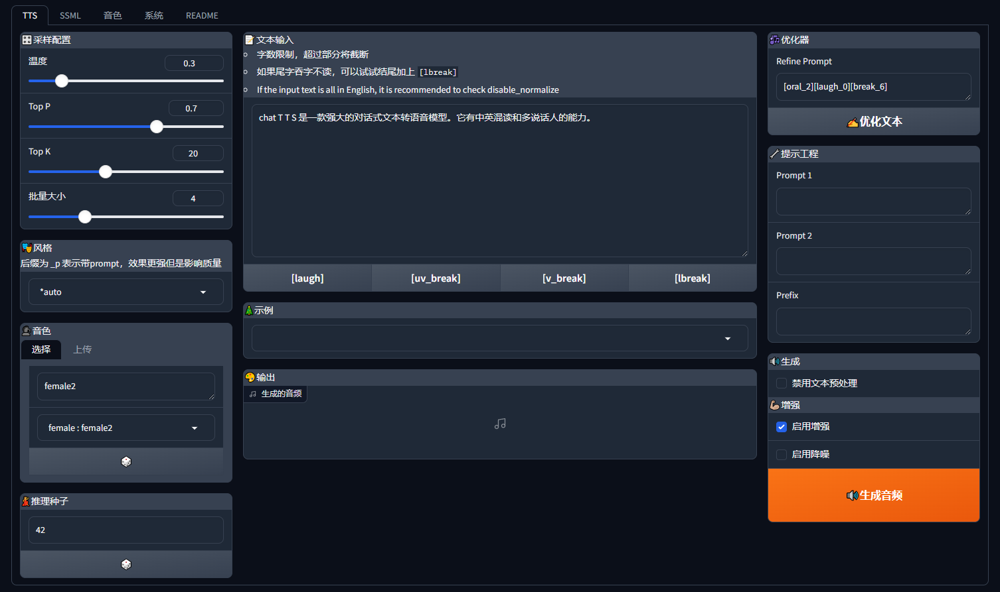

[](https://t.me/+Nqh6IFJmvHQ1NzQ9) 
[](https://discord.gg/9XnXUhAy3t)


# 🍦 Speech-AI-Forge

Speech-AI-Forge 是一个围绕 TTS 生成模型开发的项目，实现了 API Server 和 基于 Gradio 的 WebUI。



你可以通过以下几种方式体验和部署 Speech-AI-Forge：

| -            | 描述                     | 链接                                                                                                                                                               |
| ------------ | ------------------------ | ------------------------------------------------------------------------------------------------------------------------------------------------------------------ |
| **整合包** | Windows整合包解压即用         | [Releases](https://github.com/lenML/Speech-AI-Forge/releases) |
| **Colab体验** | 点击按钮，一键启动 Colab | [](https://colab.research.google.com/github/lenML/Speech-AI-Forge/blob/main/colab.ipynb) |
| **本地部署** | 查看环境准备部分         | [本地部署](#InstallationandRunning)                                                                                                                                |
| **容器部署** | 查看 docker 部分         | [Docker](#docker)                                                                                                                                                  |

## Breaking change logs

- 260402: Support Cloud TTS (minimax tts) [#293](https://github.com/lenML/Speech-AI-Forge/pull/293)
- 260202: Support CosyVoice3 [#264](https://github.com/lenML/Speech-AI-Forge/issues/264)
- 260129: Support Qwen3-TTS [#282](https://github.com/lenML/Speech-AI-Forge/issues/282)
- 250912: Support Index-TTS-2 [#265](https://github.com/lenML/Speech-AI-Forge/issues/265)
- 250702: Support Index-TTS-1.5 [#250](https://github.com/lenML/Speech-AI-Forge/issues/250)
- 250522: Support GptSoVits [#198](https://github.com/lenML/Speech-AI-Forge/issues/198)
- 250518: Support SenseVoice ASR [#122](https://github.com/lenML/Speech-AI-Forge/issues/122)
- 250508: Support Spark-TTS [#223](https://github.com/lenML/Speech-AI-Forge/issues/223)
- 250507: Support F5TTS-TTS-v1 model [#231](https://github.com/lenML/Speech-AI-Forge/issues/231)
- 250505: Support Index-TTS [#229](https://github.com/lenML/Speech-AI-Forge/issues/229)
- 241111: Add `v2/tts` API [#187](https://github.com/lenML/Speech-AI-Forge/issues/187)
- 241109: Support fishspeech [#191](https://github.com/lenML/Speech-AI-Forge/issues/191)
- 241015: Support F5TTS v0.6.2 [#176](https://github.com/lenML/Speech-AI-Forge/issues/176)
- 241009: Support FireRedTTS [#165](https://github.com/lenML/Speech-AI-Forge/issues/165)
- 240813: Support OpenVoice [#100](https://github.com/lenML/Speech-AI-Forge/issues/100)
- 240801: Add ASR API [#92](https://github.com/lenML/Speech-AI-Forge/issues/92)
- 240723: Support CosyVoice [#90](https://github.com/lenML/Speech-AI-Forge/issues/90)

## Installation and Running

首先，确保 [相关依赖](./docs/dependencies.md) 已经正确安装，并查看 [模型下载](#模型下载) 下载所需模型

启动：

```
python webui.py
```
<details>
<summary>WebUI 功能</summary>

[点我看详细图文介绍](./docs/webui_features.md)

- **TTS (文本转语音)**: 提供多种强大的 TTS 功能

  - **音色切换 (Speaker Switch)**: 可选择不同音色
    - **内置音色**: 提供多个内置音色，包括 `27 ChatTTS` / `7 CosyVoice` 音色 + `1 参考音色`
    - **自定义音色上传**: 支持上传自定义音色文件并进行实时推理
    - **参考音色**: 支持上传参考音频/文本，直接基于参考音频进行 TTS 推理
  - **风格控制 (Style)**: 内置多种风格控制选项，调整语音风格
  - **长文本推理 (Long Text)**: 支持超长文本的推理，自动分割文本
    - **Batch Size**: 支持设置 `Batch size`，提升支持批量推理模型的长文本推理速度
  - **Refiner**: 支持 `ChatTTS` 原生文本 `refiner`，支持无限长文本处理
  - **分割器设置 (Splitter)**: 调整分割器配置，控制分割结束符（`eos`）和分割阈值
  - **调节器 (Adjuster)**: 支持调整 `速度/音调/音量`，并增加 `响度均衡` 功能，优化音频输出
  - **人声增强 (Voice Enhancer)**: 使用 `Enhancer` 模型增强 TTS 输出，提高语音质量
  - **生成历史 (Generation History)**: 保存最近三次生成结果，便于对比和选择
  - **多模型支持 (Multi-model Support)**: 支持多种 TTS 模型推理，包括 `ChatTTS` / `CosyVoice` / `FishSpeech` / `GPT-SoVITS` / `F5-TTS` 等

- **SSML (语音合成标记语言)**: 提供高级 TTS 合成控制工具

  - **分割器 (Splitter)**: 精细控制长文本的分割结果
  - **Podcast**: 帮助创建 `长文本`、`多角色` 的音频，适合博客或剧本式的语音合成
  - **From Subtitle**: 从字幕文件生成 SSML 脚本，方便一键生成语音
  - **脚本编辑器 (Script Editor)**: 新增 SSML 脚本编辑器，支持从分割器（Podcast、来自字幕）导出并编辑 SSML 脚本，进一步优化语音生成效果

- **音色管理 (Voice Management)**:

  - **音色构建器 (Builder)**: 创建自定义音色，可从 ChatTTS seed 创建音色，或使用参考音频生成音色
  - **试音功能 (Test Voice)**: 上传音色文件，进行简单的试音和效果评估
  - **ChatTTS 调试工具**: 专门针对 `ChatTTS` 音色的调试工具
    - **音色抽卡 (Random Seed)**: 使用随机种子抽取不同的音色，生成独特的语音效果
    - **音色融合 (Blend)**: 融合不同种子创建的音色，获得新的语音效果
  - **音色 Hub**: 从音色库中选择并下载音色到本地，访问音色仓库 [Speech-AI-Forge-spks](https://github.com/lenML/Speech-AI-Forge-spks) 获取更多音色资源

- **ASR (自动语音识别)**:

  - **ASR**: 使用 Whisper/SenseVoice 等模型进行高质量的语音转文本（ASR）
  - **Force Aligment**: 使用 Whisper 模型可以进行【文稿匹配】提高识别准确性

- **工具 (Tools)**:
  - **后处理工具 (Post Process)**: 提供音频剪辑、调整和增强等功能，优化生成的语音质量

</details>

### `launch.py`: API Server

某些情况，你并不需要 webui 或者需要更高的 api 吞吐，那么可以使用这个脚本启动单纯的 api 服务。

启动：

```
python launch.py
```

启动之后开启 `http://localhost:7870/docs` 可以查看开启了哪些 api 端点

更多帮助信息:

- 通过 `python launch.py -h` 查看脚本参数
- 查看 [API 文档](./docs/api.md)

## Docker

### 手动 build

- webui: `docker-compose -f ./docker-compose.webui.yml up -d`
- api: `docker-compose -f ./docker-compose.api.yml up -d`

环境变量配置

- webui: [.env.webui](./.env.webui)
- api: [.env.api](./.env.api)

## 模型支持

| 模型类别        | 模型名称                                                           | 支持多语言          | 实现情况    |
|-----------------|--------------------------------------------------------------------|---------------------|-------------|
| **TTS**         |                        |               |            |
|                 | [Index-TTS](https://github.com/index-tts/index-tts)                | en, zh              | ✅ (v1/v1.5) |
|                 | [Qwen3-TTS](https://github.com/QwenLM/Qwen3-TTS)                   | en, zh              | ✅ |
|                 | [FishSpeech](https://github.com/fishaudio/fish-speech)             | en, zh, jp, ko      | ✅ (1.4)     |
|                 | [CosyVoice](https://github.com/FunAudioLLM/CosyVoice)              | en, zh, jp, yue, ko | ✅ (v2/v3)      |
|                 | [FireRedTTS](https://github.com/FireRedTeam/FireRedTTS)            | en, zh              | ✅           |
|                 | [F5-TTS](https://github.com/SWivid/F5-TTS)                         | en, zh              | ✅ (v0.6/v1) |
|                 | [Spark-TTS](https://github.com/SparkAudio/Spark-TTS)               | en, zh              | ✅           |
|                 | [GPT-SoVITS](https://github.com/RVC-Boss/GPT-SoVITS/tree/main)     | en, zh, ja, ko, yue | ✅           |
|          | [ChatTTS](https://github.com/2noise/ChatTTS)                       | en, zh              | ✅           |
| **Cloud TTS**   |                        |                   |            |
|                 | [MiniMax Cloud TTS](https://platform.minimaxi.com/)                | en, zh, jp, ko + more | ✅ (speech-2.8-hd/turbo) |
| **ASR**         |                        |                   |            |
|          | [Whisper](https://github.com/openai/whisper)                       | ✅                  | ✅           |
|                 | [SenseVoice](https://github.com/FunAudioLLM/SenseVoice)            | ✅                  | ✅           |
| **Voice Clone** | [OpenVoice](https://github.com/myshell-ai/OpenVoice)               | —                   | ✅           |
| **Enhancer**    | [ResembleEnhance](https://github.com/resemble-ai/resemble-enhance) | —                   | ✅           |

## 模型下载

```bash
python -m scripts.download_models --source=modelscope --models="model1,model2,..."
```

> 🔍 **说明**：
> - 支持 `--source=huggingface` 或 `--source=modelscope` 或 `--source=auto` （自动根据网络环境选择hf或者ms）
> - 模型 ID 大小写不敏感，可忽略 `-`, `_`, `/` 等符号
> - 例如：`Qwen3-TTS-12Hz-0.6B-Base` 可写作 `qwen3tts12hz06bbase` 或 `qwen3-tts-0.6b-base`

<details>
<summary>📌 模型ID列表</summary>

| 模型类别       | 内部模型 ID（可直接用于 `--models`） |
|----------------|----------------------------------------|
| **TTS**        | `ChatTTS`                              |
|                | `CosyVoice2-0.5B`                      |
|                | `CosyVoice_300M_Instruct`              |
|                | `Fun-CosyVoice3-0.5B-2512`              |
|                | `F5-TTS-V1`                            |
|                | `FireRedTTS`                           |
|                | `fish-speech-1_4`                      |
|                | `fish-speech-1.2-sft`                  |
|                | `Index-TTS-1.5`                        |
|                | `Index-TTS`                            |
|                | `Index-TTS-2`                          |
|                | `Qwen3-TTS-12Hz-0.6B-Base`             |
|                | `Qwen3-TTS-12Hz-0.6B-CustomVoice`      |
|                | `Qwen3-TTS-12Hz-1.7B-Base`             |
|                | `Qwen3-TTS-12Hz-1.7B-CustomVoice`      |
|                | `Qwen3-TTS-12Hz-1.7B-VoiceDesign`      |
|                | `Spark-TTS-0.5B`                       |
|                | `gpt_sovits_v4`                        |
| **ASR**        | `faster-whisper-large-v3`              |
|                | `faster-whisper-large-v3-turbo-ct2`    |
|                | `SenseVoiceSmall`                      |
| **CV / Voice Clone** | `OpenVoiceV2`                     |
| **Enhancer**   | `resemble-enhance`                     |
| **依赖模型（Index-TTS-2 所需）** | `amphion/MaskGCT`       |
|                                 | `nvidia/bigvgan_v2_22khz_80band_256x` |
|                                 | `funasr/campplus`                      |
|                                 | `facebook/w2v-bert-2.0`               |
|                                 | `vocos-mel-24khz`                      |
|    (sense_voice依赖)            | `fsmn-vad`                             |
</details>

## 自动下载

配置环境变量 `AUTO_DOWNLOAD` 或者运行参数 `--auto_download`

- `auto_download=False`: 关闭自动下载
- `auto_download=*`: 当使用到的时候自动下载匹配的模型 `"*"` 表示通配所有模型
- `auto_download=qwen3*`: 自动下载 `"qwen3"` 开头的模型

## FAQ

[Goto Discussion Page](https://github.com/lenML/Speech-AI-Forge/discussions/242)

# Documents

[](https://deepwiki.com/lenML/Speech-AI-Forge)

[Learn About Documents](https://github.com/lenML/Speech-AI-Forge/issues/240)

# Contributing

To contribute, clone the repository, make your changes, commit and push to your clone, and submit a pull request.

## format code

```
isort --profile black
```

# References

- ChatTTS: https://github.com/2noise/ChatTTS
- PaddleSpeech: https://github.com/PaddlePaddle/PaddleSpeech
- resemble-enhance: https://github.com/resemble-ai/resemble-enhance
- OpenVoice: https://github.com/myshell-ai/OpenVoice
- FishSpeech: https://github.com/fishaudio/fish-speech
- SenseVoice: https://github.com/FunAudioLLM/SenseVoice
- CosyVoice: https://github.com/FunAudioLLM/CosyVoice
- FireRedTTS: https://github.com/FireRedTeam/FireRedTTS
- F5-TTS: https://github.com/SWivid/F5-TTS
- Index-TTS: https://github.com/index-tts/index-tts
- Spark-TTS: https://github.com/SparkAudio/Spark-TTS
- GPT-SoVITS: https://github.com/RVC-Boss/GPT-SoVITS
- Qwen3-TTS: https://github.com/QwenLM/Qwen3-TTS

- Whisper: https://github.com/openai/whisper

- ChatTTS 默认说话人: https://github.com/2noise/ChatTTS/issues/238
