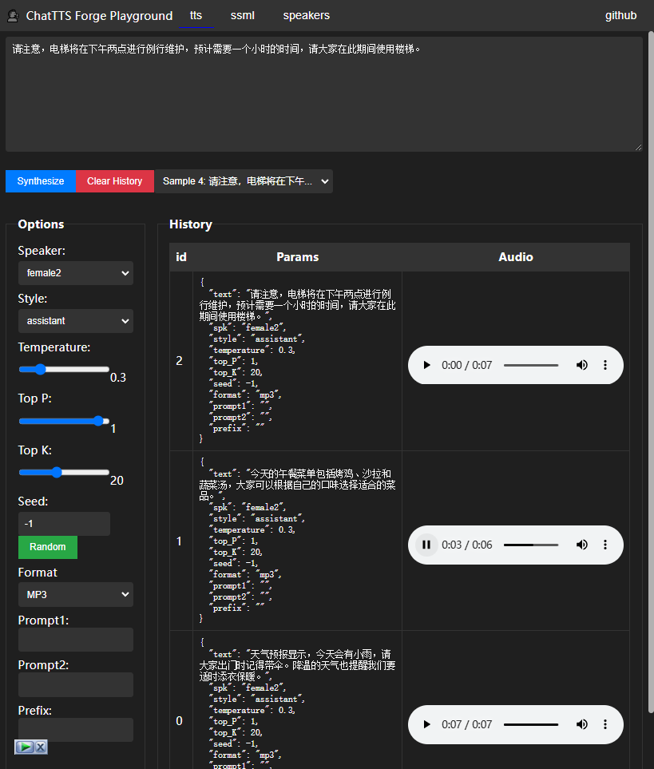

# API

使用 `launch.py` 脚本启动 `api` 服务之后，你可以在 `http://localhost:7870/docs` 下查看和简单测试 `api`

```
usage: launch.py [-h] [--cors_origin CORS_ORIGIN] [--no_playground] [--no_docs] [--exclude EXCLUDE]
                 [--compile] [--flash_attn] [--no_half] [--off_tqdm] [--device_id DEVICE_ID]
                 [--use_cpu {all,chattts,enhancer,trainer} [{all,chattts,enhancer,trainer} ...]]
                 [--lru_size LRU_SIZE] [--debug_generate] [--preload_models] [--host HOST] [--port PORT]
                 [--reload] [--workers WORKERS] [--log_level LOG_LEVEL] [--access_log] [--proxy_headers]
                 [--timeout_keep_alive TIMEOUT_KEEP_ALIVE]
                 [--timeout_graceful_shutdown TIMEOUT_GRACEFUL_SHUTDOWN] [--ssl_keyfile SSL_KEYFILE]
                 [--ssl_certfile SSL_CERTFILE] [--ssl_keyfile_password SSL_KEYFILE_PASSWORD]

Start the FastAPI server with command line arguments

options:
  -h, --help            show this help message and exit
  --cors_origin CORS_ORIGIN
                        Allowed CORS origins. Use '*' to allow all origins.
  --no_playground       Disable the playground entry
  --no_docs             Disable the documentation entry
  --exclude EXCLUDE     Exclude the specified API from the server
  --compile             Enable model compile
  --flash_attn          Enable flash attention
  --no_half             Disalbe half precision for model inference
  --off_tqdm            Disable tqdm progress bar
  --device_id DEVICE_ID
                        Select the default CUDA device to use (export CUDA_VISIBLE_DEVICES=0,1,etc might
                        be needed before)
  --use_cpu {all,chattts,enhancer,trainer} [{all,chattts,enhancer,trainer} ...]
                        use CPU as torch device for specified modules
  --lru_size LRU_SIZE   Set the size of the request cache pool, set it to 0 will disable lru_cache
  --debug_generate      Enable debug mode for audio generation
  --preload_models      Preload all models at startup
  --host HOST           Host to run the server on
  --port PORT           Port to run the server on
  --reload              Enable auto-reload for development
  --workers WORKERS     Number of worker processes
  --log_level LOG_LEVEL
                        Log level
  --access_log          Enable access log
  --proxy_headers       Enable proxy headers
  --timeout_keep_alive TIMEOUT_KEEP_ALIVE
                        Keep-alive timeout duration
  --timeout_graceful_shutdown TIMEOUT_GRACEFUL_SHUTDOWN
                        Graceful shutdown timeout duration
  --ssl_keyfile SSL_KEYFILE
                        SSL key file path
  --ssl_certfile SSL_CERTFILE
                        SSL certificate file path
  --ssl_keyfile_password SSL_KEYFILE_PASSWORD
                        SSL key file password
```

tips:

- 所有参数均可在 .env.api 中以大写形式配置 （比如 no_docs => NO_DOCS）
- 在命令行之后的参数优先级高于 .env 参数
- launch.py 脚本启动成功后，你可以在 `/docs` 下检查 api 是否开启。

下面特殊接口的介绍

## <a name='OpenAIAPI:v1audiospeech'></a>OpenAI API: `v1/audio/speech`

### 1. 语音合成 API

#### Endpoint

`POST /v1/audio/speech`

#### 请求体

| 参数名              | 类型     | 默认值         | 描述                                                                                |
| ------------------- | -------- | -------------- | ----------------------------------------------------------------------------------- |
| `input`             | `string` | **必填**       | 需要合成的文本                                                                      |
| `model`             | `string` | `"chattts-4w"` | 模型名称                                                                            |
| `voice`             | `string` | `"female2"`    | 语音类型                                                                            |
| `response_format`   | `string` | `"mp3"`        | 响应音频格式，可选值：`mp3`, `wav`, `ogg`                                           |
| `speed`             | `float`  | `1`            | 音频播放速度，范围是 `0.1` 到 `10`                                                  |
| `seed`              | `int`    | `42`           | 随机种子                                                                            |
| `temperature`       | `float`  | `0.3`          | 控制生成的温度参数                                                                  |
| `top_k`             | `int`    | `20`           | 生成文本时考虑的最高概率词的数量                                                    |
| `top_p`             | `float`  | `0.7`          | 生成文本时的累积概率阈值                                                            |
| `style`             | `string` | `""`           | 风格                                                                                |
| `batch_size`        | `int`    | `1`            | 是否开启 batch 合成，小于等于 1 表示不使用 batch 合成（不推荐），范围是 `1` 到 `20` |
| `spliter_threshold` | `float`  | `100`          | 开启 batch 合成时，句子分割的阈值，范围是 `10` 到 `1024`                            |
| `eos`               | `string` | `"[uv_break]"` | 句子结束标志                                                                        |
| `enhance`           | `bool`   | `false`        | 是否启用增强功能                                                                    |
| `denoise`           | `bool`   | `false`        | 是否启用降噪功能                                                                    |

#### 响应

返回一个音频文件，格式根据 `response_format` 参数确定。

#### 示例

```bash
curl http://localhost:7870/v1/audio/speech \
  -H "Authorization: Bearer anything_your_wanna" \
  -H "Content-Type: application/json" \
  -d '{
    "model": "chattts",
    "input": "Today is a wonderful day to build something people love! [lbreak]",
    "voice": "female2",
    "style": "chat",
    "response_format": "mp3"
  }' \
  --output speech.mp3
```

也可以使用 openai 库调用，具体可以看 [openai 官方文档](https://platform.openai.com/docs/guides/text-to-speech)

## <a name='GoogleAPI:v1text:synthesize'></a>Google API: `/v1/text:synthesize`

### Endpoint

`POST /v1/text:synthesize`

### Description

This endpoint synthesizes speech from text or SSML input using the Google Text-to-Speech API. It accepts various configuration parameters to customize the speech synthesis process. The API is designed to be compatible with Google's API while supporting additional parameters specific to this system.

### Request Body

| Field            | Type                   | Description                                                                                          |
| ---------------- | ---------------------- | ---------------------------------------------------------------------------------------------------- |
| `input`          | `SynthesisInput`       | Contains either `text` or `ssml` to be synthesized.                                                  |
| `voice`          | `VoiceSelectionParams` | Specifies the voice parameters, including language code, speaker name, style, and other TTS options. |
| `audioConfig`    | `AudioConfig`          | Specifies the audio configuration, such as encoding format, speaking rate, pitch, and volume gain.   |
| `enhancerConfig` | `EnhancerConfig`       | (Optional) Additional configuration for audio enhancement.                                           |

#### SynthesisInput

| Field  | Type  | Description                       |
| ------ | ----- | --------------------------------- |
| `text` | `str` | The text input to be synthesized. |
| `ssml` | `str` | The SSML input to be synthesized. |

#### VoiceSelectionParams

| Field          | Type    | Description                                         |
| -------------- | ------- | --------------------------------------------------- |
| `languageCode` | `str`   | The language code for the voice (default: "ZH-CN"). |
| `name`         | `str`   | The name of the voice (default: "female2").         |
| `style`        | `str`   | The style of the voice (default: "").               |
| `temperature`  | `float` | The temperature for the TTS model (default: 0.3).   |
| `topP`         | `float` | The topP value for the TTS model (default: 0.7).    |
| `topK`         | `int`   | The topK value for the TTS model (default: 20).     |
| `seed`         | `int`   | The seed value for inference (default: 42).         |
| `eos`          | `str`   | The end-of-sentence marker (default: "[uv_break]"). |

#### AudioConfig

| Field              | Type          | Description                                               |
| ------------------ | ------------- | --------------------------------------------------------- |
| `audioEncoding`    | `AudioFormat` | The audio encoding format (default: `AudioFormat.mp3`).   |
| `speakingRate`     | `float`       | The speaking rate (default: 1).                           |
| `pitch`            | `float`       | The pitch (default: 0).                                   |
| `volumeGainDb`     | `float`       | The volume gain in dB (default: 0).                       |
| `sampleRateHertz`  | `int`         | The sample rate in Hertz (default: 24000).                |
| `batchSize`        | `int`         | The batch size for inference (default: 4).                |
| `spliterThreshold` | `int`         | The splitter threshold for text splitting (default: 100). |

#### EnhancerConfig

| Field | Type | Description |
| ----- | ---- | ----------- |
| ...   | ...  | ...         |

### Response

| Field          | Type  | Description                                        |
| -------------- | ----- | -------------------------------------------------- |
| `audioContent` | `str` | The base64-encoded audio content of the synthesis. |

### Example CURL Request

```bash
curl -X POST "http://localhost:7870/v1/text:synthesize" \
    -H "Content-Type: application/json" \
    -d '{
        "input": {
            "text": "Hello, this is a test."
        },
        "voice": {
            "languageCode": "ZH-CN",
            "name": "female2",
            "style": "",
            "temperature": 0.3,
            "topP": 0.7,
            "topK": 20,
            "seed": 42,
            "eos": "[uv_break]"
        },
        "audioConfig": {
            "audioEncoding": "mp3",
            "speakingRate": 1,
            "pitch": 0,
            "volumeGainDb": 0,
            "sampleRateHertz": 24000,
            "batchSize": 4,
            "spliterThreshold": 100
        },
        "enhancerConfig": null
    }'
```

## playground

启动 api 服务之后，在 `/playground` 下有一个非 gradio 的调试页面用于接口测试



> 如果不需要此页面，启动服务的时候加上 `--no_playground` 即可
