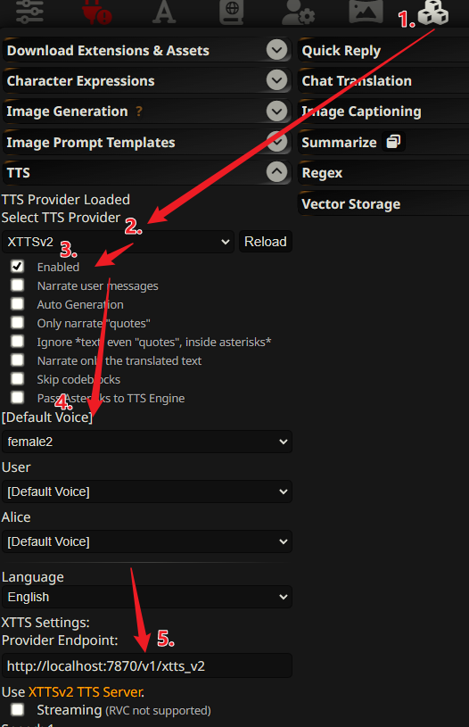

### XTTS v2 API

XTTS v2 系列 API 支持一些外部应用的调用，例如与 SillyTavern 的集成。

#### 支持的 API 列表

| 方法 | 路径                       | 描述                        |
| ---- | -------------------------- | --------------------------- |
| GET  | `/v1/xtts_v2/speakers`     | 获取可用的发音人列表        |
| POST | `/v1/xtts_v2/tts_to_audio` | 将文本转化为音频文件        |
| GET  | `/v1/xtts_v2/tts_stream`   | 获取 TTS 实时音频流         |
| POST | `/v1/xtts_v2/set_tts_settings` | 设置 TTS 参数配置       |

具体的调用参数可以在启动服务后访问 `/docs` 端点查看。

#### 如何连接到 SillyTavern？

通过 `/v1/xtts_v2` 系列 API，可以轻松将 ChatTTS-Forge 连接到 SillyTavern 中。以下是配置指南：

1. 打开 SillyTavern 的插件扩展界面。
2. 进入 `TTS` 插件的配置部分。
3. 将 `TTS Provider` 切换为 `XTTSv2`。
4. 勾选 `Enabled` 启用。
5. 选择并配置 `Voice` 语音。
6. **关键步骤**：将 `Provider Endpoint` 设置为 `http://localhost:7870/v1/xtts_v2`。



#### 配置 XTTS API 默认参数

首先使用 `/v1/xtts_v2/set_tts_settings` 可以配置此 API 的运行时参数，但是为兼容 `xtts_v2` 可配置参数有限，比如 `无法指定模型`

所以，还可以通过配置项目根目录下 `xttsv2.config.json` 文件配置 `xtts_v2` 接口 默认参数。

一个基础的配置如下:
```json
{
  "stream_chunk_size": 100,
  "temperature": 0.3,
  "speed": 1,
  "length_penalty": 0.5,
  "repetition_penalty": 1.2,
  "top_k": 20,
  "top_p": 0.7,
  "enable_text_splitting": true,
  "batch_size": 4,
  "eos": " 。 ",
  "infer_seed": 42,
  "spliter_threshold": 100,
  "model_name": "cosy-voice",
  "enable_enhancer": false
}
```
