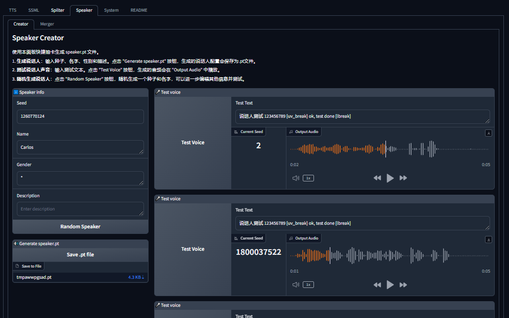
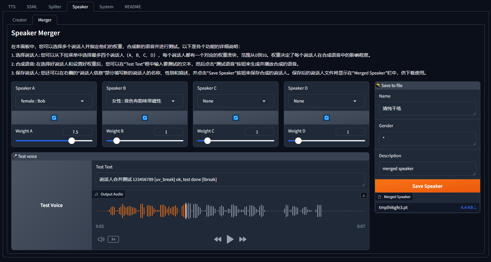

# WebUI Features

## webui.py

`webui.py` 是一个用于配置和启动 Gradio Web UI 界面的脚本。

```
usage: webui.py [-h] [--server_name SERVER_NAME] [--server_port SERVER_PORT] [--share] [--debug] [--auth AUTH] [--tts_max_len TTS_MAX_LEN]
                [--ssml_max_len SSML_MAX_LEN] [--max_batch_size MAX_BATCH_SIZE] [--webui_experimental] [--language LANGUAGE] [--api]
                [--off_track_tqdm] [--compile] [--flash_attn] [--no_half] [--off_tqdm] [--device_id DEVICE_ID]
                [--use_cpu {all,chattts,enhancer,trainer} [{all,chattts,enhancer,trainer} ...]] [--lru_size LRU_SIZE] [--debug_generate]
                [--preload_models] [--cors_origin CORS_ORIGIN] [--no_playground] [--no_docs] [--exclude EXCLUDE]

Gradio App

options:
  -h, --help            show this help message and exit
  --server_name SERVER_NAME
                        server name
  --server_port SERVER_PORT
                        server port
  --share               share the gradio interface
  --debug               enable debug mode
  --auth AUTH           username:password for authentication
  --tts_max_len TTS_MAX_LEN
                        Max length of text for TTS
  --ssml_max_len SSML_MAX_LEN
                        Max length of text for SSML
  --max_batch_size MAX_BATCH_SIZE
                        Max batch size for TTS
  --webui_experimental  Enable webui_experimental features
  --language LANGUAGE   Set the default language for the webui
  --api                 use api=True to launch the API together with the webui (run launch.py for only API server)
  --off_track_tqdm      turn off track_tqdm
  --compile             Enable model compile
  --flash_attn          Enable flash attention
  --no_half             Disalbe half precision for model inference
  --off_tqdm            Disable tqdm progress bar
  --device_id DEVICE_ID
                        Select the default CUDA device to use (export CUDA_VISIBLE_DEVICES=0,1,etc might be needed before)
  --use_cpu {all,chattts,enhancer,trainer} [{all,chattts,enhancer,trainer} ...]
                        use CPU as torch device for specified modules
  --lru_size LRU_SIZE   Set the size of the request cache pool, set it to 0 will disable lru_cache
  --debug_generate      Enable debug mode for audio generation
  --preload_models      Preload all models at startup
  --cors_origin CORS_ORIGIN
                        Allowed CORS origins. Use '*' to allow all origins.
  --no_playground       Disable the playground entry
  --no_docs             Disable the documentation entry
  --exclude EXCLUDE     Exclude the specified API from the server
```

tips:

- 所有参数均可在 .env.webui 中以大写形式配置 （比如 no_docs => NO_DOCS）
- 在命令行之后的参数优先级高于 .env 参数
- 从 webui.py 入口启动， 可与 api 同时启动，api 的配置在下方 launch.py 脚本参数中说明， 开启后可在 `http://localhost:7860/docs` 查看 api
- 由于 `MKL FFT doesn't support tensors of type: Half` 所以 `--use_cpu="all"` 时需要开启 `--no_half`

## TTS

该页面提供了一个强大的对话式文本转语音（TTS）模型接口，支持中英文混读和多说话人能力。用户可以通过调节各种参数生成高质量的语音输出。


### 关于参数的解释

#### 音色切换


- 可输入 seed 、 说话人名称 使用内置说话人
- 切换到 `上传` tab，可以上传 `.spkv1.json` 文件，使用说话人来推理
- 切换到 `refrence` tab， 可以使用参考音频推理 （注意，参考音频必须和对应文本一起使用）

#### Style


音色风格，此处提供对于音色的内置风格切换的功能

> 注意 1： ChatTTS 模型并不原生支持 prompt，所以对于风格控制能力并不一定理想

> 注意 2： CosyVoice 中只有 \_p 的 style， 因为 CosyVoice 支持 prompt 指导生成

#### 采样配置


- 温度： 越高生成结果越有创意性越有真实感，但是质量可能下降
- Top P: 和温度类似，但是不能太低
- Top K: 和温度类似，但是不能太低
- 批量大小： 在文本分割之后会根据这个批量大小分批合成输出，6 以内基本不会增加内存占用，超过 6 个 batch 同时文本超长，那么很有可能产生超过正常运行所需的显存占用

#### 文本输入


现已支持超长文本生成，超长文本将根据分割器配置，自动分割然后合成并合并。

#### 分割器配置


可以对分割器进行配置，可配置 eos 和 阈值

- eos： 即每个分割片段用什么字符链接，比如 `你好啊` `再见` 这两句话，如果 `eos="？"` 那边，拼接之后为 `你好啊？再见`
- 阈值： 即配置多少个 token （2 个中文/token 5 个英语/token） 会触发分割

#### 调节器


调节器可以对生成结果进行调节，可以调节 速度、音调、响度

> 其中 headroom 参数为 `响度均衡` 功能参数，一般情况使用默认值即可

#### Enhancer


人声增强、美化，使用 `Enhancer` 模型对生成结果进行人声增强和美化

> 注意: 开启增强将会增加生成时间

#### 输出历史


将会保留输出结果，并在下一次生成之后滚动保存最近三个生成结果

## SSML


此 tab 中，主要包含了关于 SSML 系统的各种使用工具

首先，关于 ssml，你可以看这个文档简单了解: [`./SSML.md`](./SSML.md)

### 编辑器


调用 SSML 功能，参数含义与 TTS 页面中一致。

### 分割器


本页面可以输出超长文本，然后将根据分割器，将其拆分为 SSML 脚本

### Podcast


本页面用于编辑 博客脚本 根据其生成对应的 ssml

### From Subtitle


此工具用于将 字幕文件 生成为本系统可以使用的 ssml

其中还会计算 字幕文件 中的空音频区域以及对生成结果进行自动的加速减速以对齐原字幕

## 音色

### Builder


在这个页面你可以创建 spk.json 文件，用于复用

- refrence audio: 参考音频，模型将基于此参考音频和文本生成
- sample audio: 示例音频，用于展示
- config: 推荐配置，用于告诉使用者推荐使用什么配置进行推理
- from seed:
  - ChatTTS: chattts 可以从随机种子中采样出说话人（质量一般都不高）

### Test Voice


在这个页面，你可以上传你的 spk.json 文件，并快速的测试和对比生成结果

### ChatTTS

此 tab 下为 ChatTTS 特有的音色工具

#### Creator

使用本面板快捷抽卡生成 speaker.pt 文件。

1. **生成说话人**：输入种子、名字、性别和描述。点击 "Generate speaker.pt" 按钮，生成的说话人配置会保存为.pt 文件。
2. **测试说话人声音**：输入测试文本。点击 "Test Voice" 按钮，生成的音频会在 "Output Audio" 中播放。
3. **随机生成说话人**：点击 "Random Speaker" 按钮，随机生成一个种子和名字，可以进一步编辑其他信息并测试。



#### Merger

在本面板中，您可以选择多个说话人并指定他们的权重，合成新的语音并进行测试。以下是各个功能的详细说明：

1. 选择说话人: 您可以从下拉菜单中选择最多四个说话人（A、B、C、D），每个说话人都有一个对应的权重滑块，范围从 0 到 10。权重决定了每个说话人在合成语音中的影响程度。
2. 合成语音: 在选择好说话人和设置好权重后，您可以在“Test Text”框中输入要测试的文本，然后点击“测试语音”按钮来生成并播放合成的语音。
3. 保存说话人: 您还可以在右侧的“说话人信息”部分填写新的说话人的名称、性别和描述，并点击“Save Speaker”按钮来保存合成的说话人。保存后的说话人文件将显示在“Merged Speaker”栏中，供下载使用。



## ASR

### Whisper


此页面提供对 whisper 模型的调用
（多用于测试模型是否可以正常运行）

## Tools

### Post Process


在 tts 生成中，对于语速语调和增强的部分，均属于后处理，此工具可以独立于 tts 生成，对音频进行后处理操作

## 系统

预留的系统配置页，暂时未实装实用功能

## FQA

1. 如何增加文本上限？
   配置 `.env.webui` 环境变量文件即可
